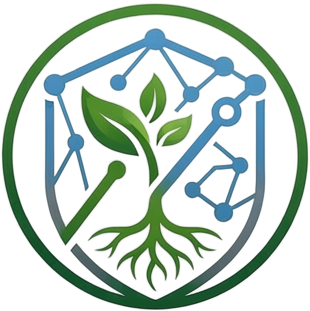
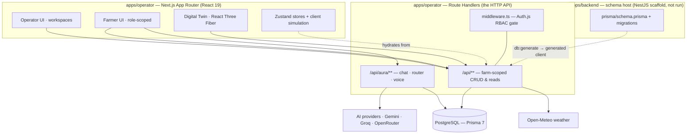

<div align="center">
  
  <h1>AgriNexus AI</h1>
  <p><strong>An AI-powered Farm Operating System — one operational picture for the whole farm.</strong></p>
</div>

---

## What it is

**AgriNexus AI** is a Farm Operating System: a single application that brings farm
intelligence, a 3D Digital Twin, sensor and weather data, and drone / ground‑robot
operations into one coherent product, with an AI reasoning layer — **AURA** — sitting
across all of it.

It is not another single‑purpose dashboard. Mission Control is the "desktop", and every
capability — the Digital Twin, fleet operations, sensor analytics, weather, analytics,
reports — is a workspace inside it. Two audiences are served from the same codebase: a
full‑control **Operator** experience and a simplified, mobile‑first **Farmer** experience
(English and Urdu).

## The problem

A working farm accumulates technology faster than it can unify it: soil sensors from one
vendor, a drone from another, a weather feed from a third, spreadsheets for everything
else. None of it shares data, terminology, or a single screen. Decisions get made on
partial information, useful data sits unused in silos, and every new device adds
complexity without adding clarity.

AgriNexus AI closes that gap: one farm model, one set of workspaces, one intelligence
layer that can reason across all of it.

## What makes it different

- **An operating system, not a dashboard.** A consistent workspace shell, a shared farm
  model, and a Digital Twin as the spatial home screen.
- **AURA is a reasoning layer, not a chatbot.** It is grounded in real farm context
  (plots, sensors, findings, missions, weather), routes each request to an appropriate
  model, and keeps a hard line between *reasoning* and *acting*: mutations run through a
  deterministic command layer that never lets a language model touch farm state directly.
- **Provider‑agnostic AI.** A Postgres‑backed routing registry with per‑capability chains,
  automatic fallback, and cooldowns — configurable from the Operator UI, not hard‑coded.
- **Farmer experience in the same product.** A role‑based, simplified surface with full
  English/Urdu localization and right‑to‑left layout — not a separate app.
- **Built to swap simulation for hardware.** Live drone/robot/sensor behavior is currently
  simulated client‑side behind the same shapes real telemetry would use.

## Core capabilities

| Area | Status |
|---|---|
| Mission Control shell + workspace navigation | Implemented |
| Digital Twin (React Three Fiber 3D farm scene, layers, overlays, mini‑map) | Implemented |
| AURA — grounded chat, model routing, fallback, EN/UR, image analysis, voice (STT/TTS) | Implemented |
| Drone & ground‑robot fleet management + mission planning (simulated execution) | Implemented |
| Sensor network + sensor analytics (simulated readings) | Implemented |
| Crop‑inspection findings, alerts, recurring missions | Implemented |
| Weather workspace (real data via Open‑Meteo) | Implemented |
| Analytics & Reports | Implemented |
| Authentication + role‑based access (Operator / Farmer / Admin) | Implemented |
| Farmer Dashboard, Farmer Digital Twin, Farmer AURA (EN/UR, RTL) | Implemented |
| Real hardware (ESP32 drones/robots/sensors), MQTT, live telemetry sync | **Planned / not implemented** |
| Multi‑tenant / multi‑farm operation | **Planned** (data model has the seams; workflows are single‑farm) |
| Autonomous action execution without operator approval | **Planned** (today AURA proposes; the operator confirms) |

## Architecture at a glance



The HTTP API is implemented entirely as **Next.js Route Handlers** inside `apps/operator`.
`apps/backend` is a minimal NestJS scaffold that is **not run as a service** — it exists
only to host the canonical Prisma schema and migrations;
`pnpm --filter backend db:generate` writes the generated client into `apps/operator`.
Full detail in
[`docs/ARCHITECTURE.md`](docs/ARCHITECTURE.md).

## AURA

AURA is the Farm Intelligence Layer. A request flows: **grounding** (a fresh
`AuraContext` built from real client stores — plots, sensors, findings, missions,
weather) → **deterministic command parsing** (a recognized operational command is handled
by a client‑side action executor; the LLM never mutates state) → **task/context
classification** → **model routing** through a per‑capability chain with automatic
fallback and cooldown → **response** (streamed, with hidden reasoning stripped).

Capabilities are separated: `text`, `image`, `speech_to_text`, `text_to_speech`. Provider
API keys are server‑only. Language handling is automatic English/Urdu detection per turn,
with an explicit answer‑language choice for image analysis. See
[`docs/AURA.md`](docs/AURA.md).

## Digital Twin

A real‑time 3D scene of the farm built with **React Three Fiber / Drei**: terrain, plots,
roads, buildings, water and environment, plus drone and robot units, mission paths,
crop‑finding markers, sensor markers, and toggleable "intelligence" overlays (crop
health, disease risk, drone coverage, irrigation, energy, sensor network, heatmaps).
Toolbar, layer panel, details panel, mini‑map, status bar and a weather‑preset control
sit over the canvas. The scene is driven by client‑side simulation today; it is not yet
synchronized to real‑world hardware. See [`docs/DIGITAL-TWIN.md`](docs/DIGITAL-TWIN.md).

## Farmer experience

Farmer is a **role‑based experience inside `apps/operator`**, not a separate application.
Three pages — **Farmer Dashboard**, **Farmer Digital Twin**, **Farmer AURA** — plus
Settings. It uses a soft, neumorphic light theme (the shared design tokens re‑valued under
a `.farmer-theme` wrapper), is fully localized in **English and Urdu** with right‑to‑left
layout, and supports voice and image input to AURA. See
[`docs/FARMER.md`](docs/FARMER.md).

## Operator experience

The full operational environment: Mission Control (Command Center), Digital Twin, Drone
Fleet, Ground Robots, Missions and Robot Missions, Sensor Network + Sensor Analytics,
Alerts, Analytics, Reports, Weather, Energy, Settings, and an Admin area for user
management. An Operator‑only AURA Router panel manages the AI endpoint registry and
per‑capability routing. Covered throughout [`docs/PRODUCT.md`](docs/PRODUCT.md).

## Technology stack

| Layer | Technology |
|---|---|
| Monorepo | Turborepo 2, pnpm 11 workspaces |
| App | Next.js 15 (App Router, Turbopack), React 19, TypeScript 5 |
| UI | Tailwind CSS 4, Radix UI primitives (shadcn‑style), `@agrinexus/ui` design system, Storybook 10, Framer Motion |
| State | Zustand 5; React Hook Form 7 + Zod 4 for forms |
| 3D | React Three Fiber 9, Drei 10, three.js 0.185 |
| Maps | Leaflet / react‑leaflet (farm‑location picker) |
| Data | PostgreSQL, Prisma 7 with the `@prisma/adapter-pg` driver adapter |
| Auth | Auth.js v5 (`next-auth` 5 beta) Credentials provider, bcryptjs, Edge middleware |
| AI | Google Gemini, Groq, OpenRouter (server‑side); adapter stubs for OpenAI / Anthropic / Ollama |
| Weather | Open‑Meteo (no API key) |
| Testing | Playwright (security / smoke / Urdu suites) |
| Backend scaffold | NestJS 11 (`apps/backend`, schema host only — not run) |

## Repository structure

```
AgriNexus-AI/
├── apps/
│   ├── operator/            Next.js app — Operator + Farmer + the HTTP API
│   │   ├── src/app/         routes, (shell) group, farmer/, admin/, api/**
│   │   ├── src/components/  workspaces, digital-twin/, aura/, farmer/
│   │   ├── src/lib/         services, Zustand stores, aura/**, auth/, weather/
│   │   ├── src/lib/prisma/generated/   generated client (gitignored)
│   │   ├── public/models/   15 GLB assets for the Digital Twin
│   │   ├── scripts/         local dev seed scripts
│   │   └── tests/           Playwright: security / smoke / urdu
│   └── backend/             NestJS scaffold — hosts prisma/schema.prisma + migrations
├── packages/
│   ├── ui/                  @agrinexus/ui design system + Storybook
│   └── config/              shared tsconfig / eslint / prettier
├── docs/                    ARCHITECTURE · PRODUCT · AURA · DIGITAL-TWIN · FARMER
│                            DATA-MODEL · DEVELOPMENT · DEPLOYMENT · SECURITY
├── logo/                    brand source images
├── package.json · pnpm-workspace.yaml · turbo.json
├── CONTRIBUTING.md · LICENSE · README.md
```

## Local development

Prerequisites: **Node.js ≥ 20**, **pnpm 11** (`corepack enable`), and a **PostgreSQL**
database.

```bash
pnpm install

# apps/operator
cp apps/operator/.env.example apps/operator/.env.local   # then fill in values
# apps/backend (schema tooling)
cp apps/backend/.env.example apps/backend/.env           # then fill in DATABASE_URL / DIRECT_URL

pnpm --filter backend db:generate                        # generate the Prisma client
# apply migrations with the Prisma CLI, e.g.:
#   cd apps/backend && npx prisma migrate deploy

pnpm dev                                                 # runs turbo dev (operator on :3000)
```

Full setup, per‑command notes, seed scripts, and Storybook are in
[`docs/DEVELOPMENT.md`](docs/DEVELOPMENT.md).

## Environment setup

Secrets are **server‑only** and never committed. Templates live at
`apps/operator/.env.example` and `apps/backend/.env.example`.

| Variable | Where | Purpose |
|---|---|---|
| `AUTH_SECRET` | operator | Auth.js session signing/encryption |
| `DATABASE_URL` | operator, backend | PostgreSQL connection string (pooled) |
| `DIRECT_URL` | backend | Direct (non‑pooled) connection for the Prisma CLI |
| `GEMINI_API_KEY`, `GEMINI_2_API_KEY` … | operator | Google Gemini (multiple keys → independent routing endpoints) |
| `OPENROUTER_API_KEY`, `OPENROUTER_2_API_KEY` … | operator | OpenRouter |
| `GROQ_API_KEY`, `GROQ_2_API_KEY` … | operator | Groq (chat + Whisper STT) |
| `GROQ_MODEL` | operator | optional model override for the OpenRouter→Groq fallback path |
| `PORT` | backend | optional; unused unless the (dormant) NestJS process is started |

AURA degrades gracefully: an unset provider key simply shows as "not configured" in the
AURA Router panel and the router skips it.

## Testing

```bash
pnpm --filter operator exec playwright install    # one-time: browser binaries
pnpm --filter operator test:e2e                   # Playwright: security + smoke + urdu
```

The Playwright suites cover a localhost‑only / SSRF network policy, application smoke
tests, and English/Urdu + RTL + voice behavior. A running dev server is required (the
config starts one via `npm run dev`). A handful of co‑located `*.test.mts` unit tests in
`src/lib/aura/` are standalone `tsx` scripts (no runner configured) — run individually
with `npx tsx <file>`.

## Deployment

`apps/operator` is a standard Next.js App Router application and deploys to any Next.js
host (Vercel being the natural fit). It needs a reachable PostgreSQL database, the
environment variables above, a generated Prisma client, and applied migrations.
`apps/backend` is not deployed. **No environment is currently live.** See
[`docs/DEPLOYMENT.md`](docs/DEPLOYMENT.md).

## Security

- All provider API keys and the database URL are server‑only (`import "server-only"` on
  every module that touches them); `.env*` files are gitignored except `.env.example`.
- Auth.js Credentials provider with bcrypt password hashes; Edge middleware enforces
  role‑based section access, and API routes re‑check authorization (defense in depth).
- Every farm‑scoped query derives the farm from the authenticated session, never from
  client input.
- The Playwright harness enforces a fail‑closed localhost‑only network policy (no external
  or download traffic during tests).

Details and responsible‑disclosure guidance: [`docs/SECURITY.md`](docs/SECURITY.md).

## Current status & limitations

- **Feature‑complete for what it demonstrates as software**; hardware, MQTT, and live
  telemetry synchronization are **not implemented**.
- Drone / robot / sensor **telemetry and mission execution are simulated** client‑side.
  Identity/configuration and mission lifecycle boundaries are persisted to PostgreSQL;
  the per‑tick simulation is not.
- Workflows are **single‑farm**. The schema (`Farm`, `FarmMembership`, session‑scoped
  ownership) is structured for multi‑tenancy, but multi‑farm UX is not built.
- AURA **proposes** operational actions and the operator confirms them; there is no
  unattended autonomous execution.
- `apps/backend` contains a NestJS scaffold that is intentionally dormant.

## Roadmap

Directional, not a commitment:

1. **Hardware integration** — ESP32 drones/robots/sensors and an MQTT transport behind the
   same interfaces the client simulation uses today; incremental, one device class at a
   time.
2. **Live Digital Twin** — real telemetry driving the 3D scene and overlays.
3. **Multi‑farm / multi‑tenant** — surface the ownership and membership model that already
   exists in the schema.
4. **Deeper AURA autonomy** — approved, well‑scoped actions executed without a
   per‑action confirmation, with a full audit trail.
5. **Backend consolidation** — either grow `apps/backend` into a real service or fold the
   schema into a top‑level `prisma/` directory.

## License

Copyright © 2026 AgriNexus AI. **All rights reserved.** This repository is published for
review and evaluation; it is source‑available, not open source. See [`LICENSE`](LICENSE).
