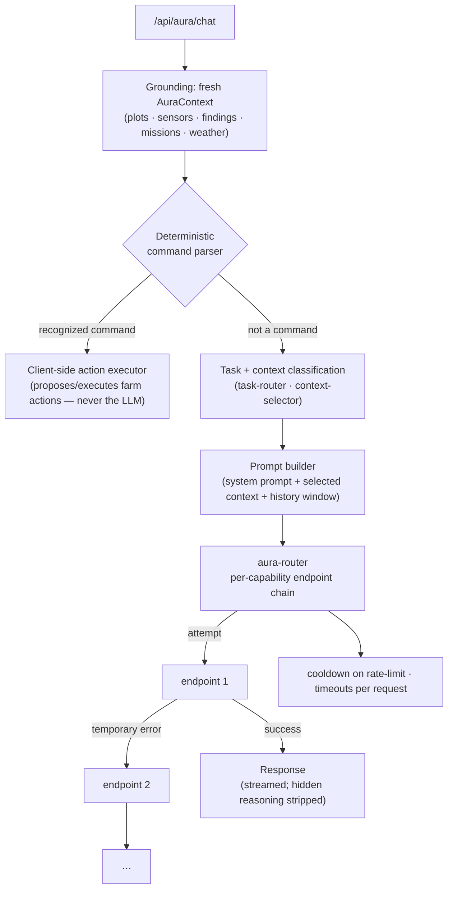
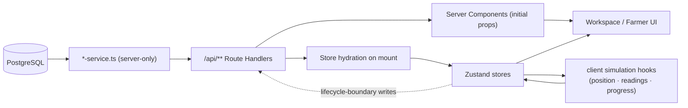

# Architecture

This describes the **current** implementation of AgriNexus AI, not a target state.

## Monorepo

A Turborepo / pnpm‑workspace monorepo. `pnpm-workspace.yaml` globs `apps/*` and
`packages/*`; `turbo.json` defines `dev`, `build`, `lint`, `type-check`, and `clean`
tasks.

```
apps/
  operator/     The product. A Next.js App Router application that also implements
                the HTTP API as Route Handlers. Contains the Operator UI, the
                role-scoped Farmer UI, the Digital Twin, and all of AURA.
  backend/      A NestJS scaffold. NOT run as a service. Its only job is to host the
                canonical Prisma schema + migrations. The Prisma generator writes the
                client into apps/operator.
packages/
  ui/           @agrinexus/ui — the shared design system (Radix-based primitives +
                product components) and its Storybook. Shipped as raw TypeScript
                source; the operator app transpiles it (next.config.ts
                `transpilePackages`).
  config/       @agrinexus/config — shared tsconfig bases, ESLint flat config, and
                Prettier config, consumed by every workspace.
```

There is no separate `apps/farmer`. Farmer is a set of routes and components inside
`apps/operator`, gated by role.

## `apps/operator` — application architecture

Next.js 15, App Router, React 19, Turbopack for `dev` and `build`.

### Route groups

```
src/app/
  (shell)/            Operator workspaces, wrapped in the app shell (sidebar, top nav).
    page.tsx          Command Center (Mission Control)
    digital-twin/     Operator Digital Twin
    drone-fleet/ · drone-fleet/missions/
    ground-robots/ · ground-robots/missions/
    sensor-network/ · sensor-network/analytics/
    alerts/ · analytics/ · reports/ · weather/ · energy/ · settings/
  farmer/            Farmer experience (role: farmer)
    page.tsx          Farmer Dashboard
    digital-twin/ · aura/ · settings/
  admin/             Admin area (role: admin) — user management
  login/ · unauthorized/
  api/**             The HTTP API (see below)
```

### Server / client boundary

- **Server Components** are used for initial data loads where practical: several pages
  fetch farm‑scoped data server‑side (e.g. plots, analytics) and pass it as props so the
  first render is populated without a client round‑trip.
- **Client Components** own interactive state via **Zustand** stores under `src/lib/**`.
  Many stores hydrate from the API on mount and then run **client‑side simulation** for
  live‑changing values (drone/robot position, sensor readings, mission progress) — see
  `use-*-simulation.ts` hooks.
- Modules that touch secrets or the database begin with `import "server-only"`, which
  fails the build if they are ever pulled into a client bundle. This applies to the
  Prisma client, every `*-service.ts`, the weather provider, and all AURA provider code.

### The HTTP API

Implemented entirely as **Next.js Route Handlers** under `src/app/api/**`. There is no
separate API server process. Route groups:

| Prefix | Purpose |
|---|---|
| `/api/auth/[...nextauth]` | Auth.js endpoints |
| `/api/admin/users`, `/api/admin/users/[id]` | user management (admin) |
| `/api/plots`, `/api/plots/[id]` | plots (read‑only at the API layer) |
| `/api/drones`, `/api/robots` (+ `/[id]`) | fleet identity/configuration CRUD |
| `/api/missions`, `/api/robot-missions` (+ `/[id]`) | mission lifecycle persistence |
| `/api/recurring-missions` (+ `/[id]`) | recurring mission schedules |
| `/api/sensors` (+ `/[id]`) | sensor CRUD |
| `/api/alerts`, `/api/alerts/[id]/resolve` | alerts |
| `/api/findings` | crop‑inspection findings |
| `/api/analytics`, `/api/reports` | derived/historical reads |
| `/api/weather` | current + forecast weather (Open‑Meteo) |
| `/api/farm/location`, `/api/farm/autonomous` | per‑farm settings |
| `/api/aura/chat` | the AURA conversational endpoint (streaming + non‑streaming) |
| `/api/aura/conversations` (+ `/[id]`, `/[id]/messages`) | chat history |
| `/api/aura/intent` | LLM intent classification |
| `/api/aura/status` | per‑provider connection status (no secrets) |
| `/api/aura/voice/transcribe`, `/api/aura/voice/speak` | STT and TTS |
| `/api/aura/router/**` | the AURA endpoint/capability routing registry (Operator/Admin) |

Every route: `import "server-only"` → `auth()` → derive the farm from the session via
`getFarmForSession` (never from client input) → a consistent `{ error }` JSON shape on
failure. Section‑level access is enforced in `middleware.ts`; each route re‑checks
authorization as defense in depth.

## `apps/backend` — current role

`apps/backend` is a NestJS 11 scaffold created but **never run**. `src/main.ts` bootstraps
an empty `AppModule` (no controllers, no providers). It is not deployed and nothing in
`apps/operator` imports from it.

Its real purpose is to be the **single home for the database schema**:

- `apps/backend/prisma/schema.prisma` — the canonical schema.
- `apps/backend/prisma/migrations/` — the ordered migration history.
- `apps/backend/prisma.config.ts` — points the Prisma CLI at `DIRECT_URL`.
- The generator (`provider = "prisma-client"`) has its `output` redirected to
  `../../operator/src/lib/prisma/generated`, so `pnpm --filter backend db:generate`
  produces the client where the app that consumes it lives. That generated directory is
  gitignored and regenerated from the schema.

`apps/operator/src/lib/prisma/client.ts` constructs a single `PrismaClient` from the
generated code, using the `@prisma/adapter-pg` driver adapter and `DATABASE_URL`
(Prisma 7 requires an explicit adapter rather than parsing the URL implicitly).

## AURA architecture

AURA lives under `apps/operator/src/lib/aura/**` and is reached through
`apps/operator/src/app/api/aura/**`. Request pipeline:



Key components:

- **Providers** (`providers/`): `gemini-provider.ts`, `groq-provider.ts`,
  `openrouter-provider.ts` are real, keyed implementations. `openai-provider.ts`,
  `claude-provider.ts`, `ollama-provider.ts` are adapter **stubs** — present so the
  abstraction is complete, with no live implementation. `provider-registry.ts` is the one
  place that maps a `ProviderId` to a concrete provider.
- **Routing registry** (`router/`): `endpoint-registry.ts` reads routable endpoints from
  Postgres (`AuraRouteEndpoint`) and per‑capability priority from
  `AuraRouteCapabilityPriority`; a one‑time default seed runs if the tables are empty.
  `aura-router.ts` walks the chain for a capability, advancing on temporary failures
  (429 / 5xx / context‑length / missing key / network timeout), applying per‑endpoint
  cooldowns and a per‑request timeout. `model-catalog.ts` is the verified
  provider → credential → model catalog the Operator "Add Model" flow uses.
- **Legacy fallback** (`providers/chat-router.ts`): an earlier per‑provider fallback
  (`chatWithFallback` / `streamChatWithFallback`) still present in the tree. The chat
  route uses the newer `aura-router` path.
- **Task routing** (`routing/task-router.ts`): deterministic classification of a
  conversational question into a category, used to pick a model.
- **Context** (`context/`): `collect-context.ts` builds the canonical `AuraContext` from
  live client stores; `context-selector.ts` decides which context domains a given
  question actually needs.
- **Commands & actions** (`commands/`, `actions/`): a regex command parser and a
  client‑side action executor. Operational mutations (create a mission, resolve a
  finding, toggle autonomous behavior, …) run here, deterministically. The LLM never
  writes farm state.
- **Intent** (`intent/`): an LLM intent classifier used only when the deterministic
  parser does not recognize a message.
- **Prompt** (`prompt/`): `prompt-builder.ts` assembles the system prompt + selected
  context + a bounded history/mission window; `strip-hidden-reasoning.ts` removes any
  model "thinking" blocks from the visible answer.
- **Voice** (`voice/`, `audio/`, `images/`): audio/image validation and preparation;
  language detection and normalization (English/Urdu).
- **Conversations** (`conversations/`): `AuraConversation` / `AuraMessage` persistence,
  scoped by user + farm.

See [`AURA.md`](AURA.md) for behavior and safety detail.

## Digital Twin architecture

`apps/operator/src/components/digital-twin/` — a **React Three Fiber / Drei** scene.

```
digital-twin/
  digital-twin-page.tsx        page chrome + mounts <Scene> via a runtime import()
  scene/
    scene.tsx                  the R3F root (memoized), camera rig, lighting, sky
    terrain.tsx · farm-plots.tsx · roads.tsx · trees.tsx
    world/                     buildings · decorations · environment · water · rain · horizon
    systems/                   drone.tsx · robot.tsx · mission-markers.tsx (per-unit motion)
    intelligence/              crop-health · disease-risk · drone-coverage · energy ·
                               irrigation · sensor-network · heatmap overlays
    findings/ · missions/ · robot-missions/ · sensors/ · sensor-analytics/   marker layers
  ui/                          toolbar · layer-panel · details-panel · mini-map ·
                               status-bar · weather-control · intelligence-legend
```

`Scene` is loaded through a plain runtime `import()` inside an effect (not a static
top‑level import and not `next/dynamic`) so the three.js bundle stays out of the
Command Center's initial payload. `public/models/` holds 15 GLB assets loaded by the
scene. The Command Center embeds a hero Digital Twin widget using the same components.

The scene is driven by the same Zustand stores + client simulation as the rest of the
app. It is **not** connected to real hardware or a live telemetry feed. See
[`DIGITAL-TWIN.md`](DIGITAL-TWIN.md).

## State & data flow



Persisted: identity/configuration (drones, robots, sensors, plots, users, farm settings)
and **mission lifecycle boundaries** (create / assign / start / pause / resume / cancel /
complete / …). Not persisted: the per‑tick simulation (position, battery, live sensor
values, second‑by‑second mission progress) — that is frontend‑only by design.

## Authentication & RBAC

- **Auth.js v5** (`next-auth` 5 beta), Credentials provider only. Passwords are bcrypt
  hashes stored on `User.passwordHash`; `lib/auth/user-source.ts` is the only module that
  reads them.
- A user has a default `role` and a `roles: Role[]` set (`admin` / `operator` /
  `farmer`) — a multi‑role account (e.g. Farmer + Operator) is supported.
- `middleware.ts` runs an Edge‑safe Auth.js instance that verifies the session JWT and
  gates sections: Operator (unprefixed) routes require `admin`/`operator`, `/farmer`
  requires `farmer`, `/admin` requires `admin`. Unauthenticated → `/login`; wrong role →
  `/unauthorized`.
- Farm scoping: `getFarmForSession` resolves the farm from the session — owner‑based for
  admin/operator, via the `FarmMembership` join table for farmer.

## Testing architecture

Playwright (`apps/operator/playwright.config.ts`), a single `chromium-secure` project,
`testDir: ./tests`, dev server started via `npm run dev`:

- `tests/security/` — a fail‑closed localhost‑only / SSRF network policy
  (`localhost-policy.ts`) and 11 security tests + application smoke checks.
- `tests/smoke/` — route‑resolves / didn't‑crash checks with real session auth.
- `tests/urdu/` — English/Urdu conversation language, automatic language detection,
  UI + RTL geometry, and first‑turn voice reliability, all through the real Farmer AURA
  UI and real provider calls (a provider timeout is reported as a limitation, never
  silently retried).

Co‑located `src/lib/aura/**/*.test.mts` files are standalone `tsx` scripts (no test
runner is configured); run individually with `npx tsx <file>`.

## Cross‑cutting principles observed in the code

- **One source of truth per domain.** A single Zustand store per domain; a single
  `AuraContext` per request; a single Prisma client.
- **Reasoning is separated from execution.** AURA classifies and recommends; a
  deterministic layer acts.
- **Fail closed.** Auth, the routing chain, the test network policy, and default password
  hashes all default to "deny" / "not configured" rather than an implicit allow.
- **Server‑only secrets.** Enforced at build time, not by convention.
