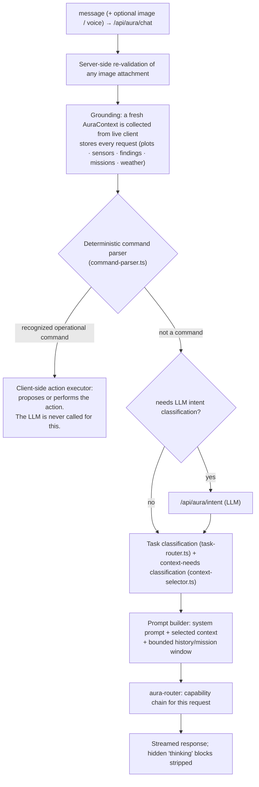

# AURA

AURA is the **Farm Intelligence Layer** of AgriNexus AI. It is not a generic chatbot: it
reasons over the real state of the farm, keeps a hard boundary between reasoning and
acting, and routes each request to an appropriate model.

Source: `apps/operator/src/lib/aura/**`. API: `apps/operator/src/app/api/aura/**`.

## What AURA is responsible for

- **Reasoning** over the current farm state as a whole — plots, sensors, findings,
  missions, weather — rather than answering from individual data points in isolation.
- **Recommendations** that are specific and tied to observable state, with the data that
  produced them visible in the response.
- **Mission proposals** — a structured plan (scope, objective, suitable vehicle) that an
  operator reviews and confirms.
- **Knowledge** — an internal agronomic knowledge base for explaining concepts in the
  context of the specific farm.
- **Conversation** — text, voice, and image input, in English or Urdu.

## Request pipeline

### Grounding

Every request builds a canonical `AuraContext` from the live Zustand stores — the same
data the workspaces show. `context-selector.ts` then decides which context *domains* a
given question actually needs, so a small question does not carry the whole farm. A
question asked while a plot is in focus carries that plot automatically. AURA never
fabricates farm data; if a value is not known, the response says so.

### Reasoning vs. action — the boundary

Operational mutations (create a mission, resolve a finding, toggle autonomous behavior,
locate a unit in the Digital Twin, …) are handled by a **deterministic** parser and a
**client‑side action executor**. A language model never writes farm state. When a
recognized command implies a real‑world consequence, AURA **proposes** it and the
operator confirms. There is no unattended autonomous execution in the current
implementation.

### Model routing

`router/` implements a routing registry backed by PostgreSQL:

- **`AuraRouteEndpoint`** rows — each a `(provider, credential env var, model)` triple
  with a capability set and a global priority. Editable from the Operator **AURA Router**
  panel ("Add Model", enable/disable, reorder).
- **`AuraRouteCapabilityPriority`** rows — a per‑capability ordering, so `text`, `image`,
  and voice each have their own independent chain.
- A one‑time default seed populates both tables if they are empty; an Operator who has
  customized routing is never overwritten.

`aura-router.ts` walks the chain for a request's capability and:

- advances to the next endpoint on a **temporary** failure — HTTP 429, a 5xx, a
  context/length limit, a missing API key, or a network timeout;
- surfaces a **non‑recoverable** failure (bad credentials, malformed request) immediately;
- applies a **cooldown** to an endpoint that returned a rate limit, so it is not hammered;
- enforces a **per‑request timeout** (with a stricter bound for automatic routing than for
  an explicitly selected model);
- returns full per‑attempt diagnostics (endpoint, reason) — never a key or a raw response
  body — so a fully failed chain is diagnosable.

An earlier per‑provider fallback (`providers/chat-router.ts`, `chatWithFallback`) is still
in the tree; the chat route uses the newer `aura-router` path.

### Providers

`providers/provider-registry.ts` is the single place that maps a `ProviderId` to a
concrete provider.

| Provider | Status |
|---|---|
| Google **Gemini** | Real implementation (text, image, TTS). Supports multiple independent keys (`GEMINI_API_KEY`, `GEMINI_2_API_KEY`, …), each its own routing endpoint. |
| **Groq** | Real implementation (text; Whisper STT via `verbose_json`). Multiple keys supported. |
| **OpenRouter** | Real implementation (text). Multiple keys supported. Default provider for the legacy fallback path. |
| OpenAI · Anthropic (Claude) · Ollama | **Adapter stubs only** — present so the abstraction is complete; no live implementation. |

Multiple keys per provider are intentional operational redundancy (separate quotas,
different models), not a quota‑bypass mechanism. All keys are server‑only.

## Capabilities

AURA separates four capabilities, routed independently:

- **`text`** — conversational answers and reasoning.
- **`image`** — crop‑image analysis. The image is validated server‑side, a predefined
  analysis prompt is used, and the answer language is chosen explicitly for that one turn.
- **`speech_to_text`** — transcription (Groq Whisper).
- **`text_to_speech`** — spoken replies (Gemini). Gemini returns raw PCM (`audio/L16`),
  which the route wraps in a WAV container so a browser `<audio>` element can play it.

## Language handling (English / Urdu)

- **Text:** the conversation language is decided **per turn** by an automatic detector
  (`voice/language-detection.ts`) — the farmer never has to toggle a language first. Each
  turn stands on its own; the previous turn's language is not carried forward.
- **Voice:** Whisper's own detected language is used, normalized to the product's two
  supported values. A first‑turn Urdu utterance that Whisper mis‑hears (Devanagari
  script / "reported Hindi") triggers one automatic retry with an explicit Urdu hint.
- **Image:** the farmer picks the answer language (English / اردو) for that image‑analysis
  turn; the choice is request‑scoped, validated server‑side against the same allowlist,
  and never written back to settings.
- The deterministic command parser recognizes both English and Urdu phrasings for the
  operational commands it supports.

## Voice AURA

The push‑to‑talk flow: `voice-recorder-button.tsx` captures audio →
`/api/aura/voice/transcribe` (STT) → the transcript is sent through the normal chat
pipeline → `/api/aura/voice/speak` (TTS) returns spoken audio. Recording and transcription
timing is captured server‑side for diagnostics (never a key, never a message body).

## Security boundaries

- Provider API keys and `DATABASE_URL` are **server‑only** (`import "server-only"` on
  every provider and service module — a build error if pulled into a client bundle).
- `/api/aura/status` reports whether each provider is reachable — never the key or any
  part of it.
- Client‑supplied flags (task category, context needs, detected language) are **re‑derived
  on the server** from the actual message; the client cannot spoof a larger context or an
  incorrect language.
- AURA conversations are scoped by **user + farm**; two farmers on the same farm cannot
  see each other's conversations.
- Image bytes are never logged; validation failures return pre‑written, farmer‑safe
  strings, never a raw provider error or stack trace.

## What AURA can and cannot do today

**Can:** answer grounded questions about the farm; explain findings and sensor trends;
propose structured missions; recognize and (with confirmation) trigger a set of
operational commands; converse in English or Urdu by text, voice, or image.

**Cannot:** execute physical actions without operator confirmation; control real hardware
(there is none connected); persist arbitrary data of its own; act outside the
authenticated user's farm.
