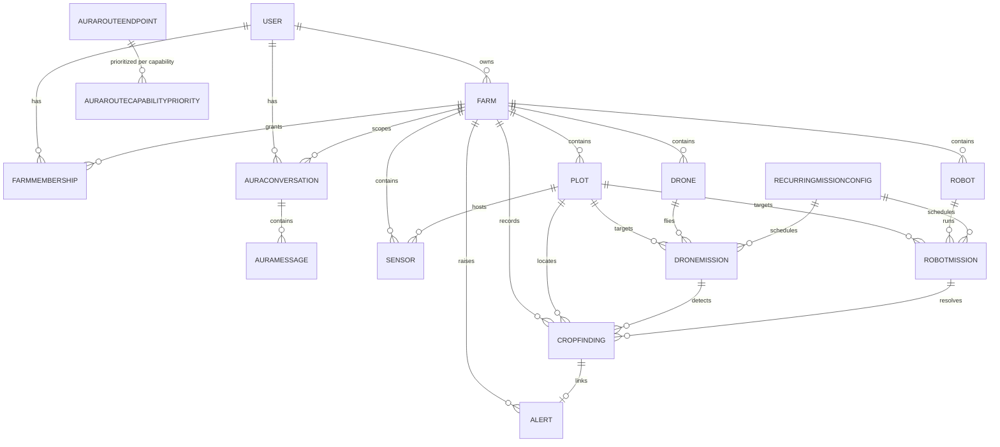

# Data model

The authoritative schema is **`apps/backend/prisma/schema.prisma`** (Prisma 7,
PostgreSQL). The ordered migration history is in
`apps/backend/prisma/migrations/` (12 migrations). This document summarizes it — the
schema file itself, with its inline comments, is the source of truth.

## Where the schema lives and how the client is generated

`apps/backend` is a NestJS scaffold that is not run; its purpose is to be the single home
for the database schema. The Prisma generator (`provider = "prisma-client"`) redirects its
`output` to `apps/operator/src/lib/prisma/generated`, so the generated client is produced
where the app that consumes it lives:

```bash
pnpm --filter backend db:generate      # prisma generate → apps/operator/src/lib/prisma/generated
```

That generated directory is gitignored and rebuilt from the schema. `apps/operator` reads
it through `src/lib/prisma/client.ts`, which constructs one `PrismaClient` using the
`@prisma/adapter-pg` driver adapter and `DATABASE_URL`.

The Prisma CLI (migrate / validate) reads `DIRECT_URL` via
`apps/backend/prisma.config.ts` — a direct, non‑pooled connection, because the schema
engine can hang against a transaction‑mode pooler.

## Entities

### Identity & access

| Model | Purpose | Notable fields / relations |
|---|---|---|
| **User** | An account. | `email` (unique), `name`, `role` (default landing role), `roles: Role[]` (full authorized set), `passwordHash` (bcrypt; default `"unset"` = fail‑closed), `status` (`active` / `disabled`). Relations: `ownedFarms`, `farmMemberships`, `auraConversations`. |
| **FarmMembership** | Resolves which `Farm` a `farmer`‑role session may access. | `@@unique([userId, farmId])`. Not used for admin/operator (they resolve by farm ownership). |
| **Farm** | The boundary every other entity belongs to; the unit of access control. | `name`, `ownerId`, `latitude`/`longitude` (nullable — real‑world location for weather), `droneAutonomousEnabled` / `robotAutonomousEnabled`. Owns every list below. |

Enums: `Role` (`admin` / `operator` / `farmer`), `UserStatus`.

### Physical farm

| Model | Purpose | Notable fields |
|---|---|---|
| **Plot** | A defined area of land — the spatial unit used by the Digital Twin, findings, and missions. | `label`, `centerX` / `centerZ` / `sizeWidth` / `sizeDepth` (Digital‑Twin scene‑space units, **not GPS**), `growthStage`. **Read‑only at the API layer** (list + get only). |
| **Sensor** | An environmental data source, scoped to the farm and optionally to a plot. | `sensorType`, `serialNumber`, `positionX` / `positionZ`, `status`, `health`, `communicationType`. `plotId` is a real FK. |
| **Drone** | An aerial unit — **identity and configuration only**. | `model`, `serialNumber`, `droneType`, `cameraType`, `batteryCapacityMah`, `maxFlightTimeMinutes`, `firmwareVersion`, `homeLocationX`/`Z`, `color`. Live position/battery/health are **not** columns. |
| **Robot** | A ground unit — identity and configuration only, mirroring `Drone`. | `robotType`, capability configuration, home position. Live telemetry is not persisted. |

Enums: `CropGrowthStage`, `DroneType`, `CameraType`, `RobotType`, `SensorType`,
`SensorStatus`, `SensorHealth`, `CommunicationType`.

### Operations

| Model | Purpose | Notable fields |
|---|---|---|
| **DroneMission** | A planned or executed aerial mission. | `missionType`, `status`, `targetPlotId` and `assignedDroneId` are **real FKs** (both nullable, `onDelete: SetNull` — a historical mission outlives the plot/vehicle it referenced), start/completion timestamps. |
| **RobotMission** | The ground equivalent, mirroring `DroneMission`. | Its own mission‑type and status enums. |
| **RecurringMissionConfig** | A recurring drone or robot mission schedule. | `RecurringVehicleKind`, interval, target plot; links to the missions it generates. |
| **CropFinding** | A detected crop issue from a drone or robot inspection. | `issueType`, `severity`, `status`, `detectionMethod`, links to the plot and the mission that found it, and (once resolved) the robot mission and corrective action that resolved it. |
| **Alert** | A condition that needs attention. | `alertType`, `severity`, a real sensor reading `value` (`null` for a crop‑finding‑linked alert — there is no honest numeric reading to show), resolution state. `findingId` links a crop‑finding alert back to its `CropFinding`. |

Enums: `DroneMissionType`, `DroneMissionStatus`, `RobotMissionType`,
`RobotMissionStatus`, `RecurringVehicleKind`, `CropIssueType`, `CropIssueSeverity`,
`CropFindingStatus`, `CropFindingDetectionMethod`, `AlertType`, `AlertSeverity`.

### AURA

| Model | Purpose | Notable fields |
|---|---|---|
| **AuraConversation** | A chat conversation, scoped by **both** `userId` and `farmId` — two farmers on the same farm cannot see each other's conversations. | title, timestamps, `messages`. |
| **AuraMessage** | One message in a conversation. | `role` (`AuraMessageRole`), `content`, `createdAt`. No column for image data — an image attachment is analyzed but not stored. |
| **AuraRouteEndpoint** | A routable AI endpoint: a `(provider, credentialEnv, model)` triple. | `displayName`, `capabilities: string[]`, `enabled`, global `priority`. `@@unique([provider, credentialEnv, model])`. `credentialEnv` is a **name**, never a secret value — the key is read from `process.env` at request time. |
| **AuraRouteCapabilityPriority** | Per‑capability routing order — `text`, `image`, and voice each get an independent chain. | `capability`, `priority`, FK to an endpoint. |

## Relationship overview



## What is deliberately **not** in the schema

Persistence is intentionally scoped. The schema does **not** contain:

- **Live telemetry** — drone/robot position, battery, health, signal; live sensor
  readings; second‑by‑second mission progress. These are simulated client‑side and never
  written to Postgres.
- `Telemetry`, `WeatherObservation`, `EnergyRecord`, `Report`, `Threshold` as tables —
  weather is fetched live from Open‑Meteo; analytics/reports are computed on read;
  thresholds live client‑side.

Mission data **is** persisted, but only at **lifecycle boundaries**
(create / assign / settings / generate / start / pause / resume / cancel / complete /
duplicate / delete) — never on the per‑tick simulation.

## Migration history

`20260819114242_init_alerts` → sensors → plots → drones/robots/missions → crop findings →
alerts/findings/recurring missions → farm autonomous state → farm location →
farmer/admin foundation (roles, memberships, password hashes) → AURA chat history →
AURA route endpoints → AURA route capability priority.

Apply with the Prisma CLI, e.g. `cd apps/backend && npx prisma migrate deploy`.
